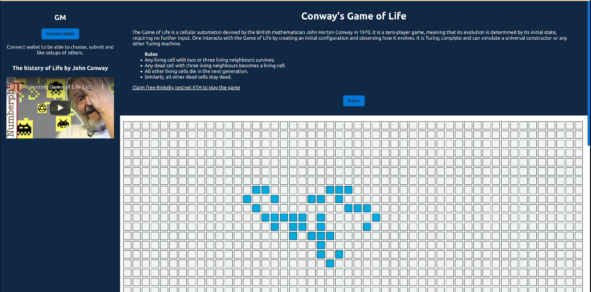

# Conway's Game of Life dApp

An escalated project to practice Solidity smartcontract interaction.

[Game of Life dApp website](https://conways-dgame-of-life.netlify.app/)

## Game of Life

The Game of Life is a cellular automaton devised by the British mathematician John Horton Conway in 1970.
It is a zero-player game, meaning that its evolution is determined by its initial state, requiring no further input.
One interacts with the Game of Life by creating an initial configuration and observing how it evolves.
It is Turing complete and can simulate a universal constructor or any other Turing machine.

## Rules

- Any living cell with two or three living neighbours survives.
- Any dead cell with three living neighbours becomes a living cell.

- All other living cells die in the next generation. Similarly, all other dead cells stay dead.

## Ethereum Contract Address

Rinkeby Testnet Network: 0xA973bEd86C1152Dbbc1873F3D2B25b79566f52D4

[Rinkeby Etherscan Contract](https://rinkeby.etherscan.io/address/0xA973bEd86C1152Dbbc1873F3D2B25b79566f52D4)

## Game Dashboard

  

## Connect-wallet Dashboard

  

